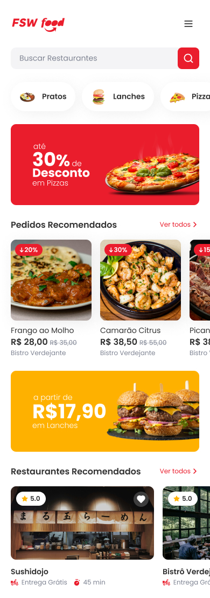

<br>

<div align="center">
  

  <h1 align="center">Fsw foods</h1>

  <p align="center">
    <strong>Project demo with NEXT JS</strong>
  </p>

  
</div>

<strong>This project is not responsive yet, please, open DevTools and toggle device toolbar to simulate a mobile viewport.</strong>

## How to run

First, install the project dependencies:

```bash
npm i
# or
yarn
# or
pnpm install
# or
bun install
```

Then, run the development server:

```bash
npm run dev
# or
yarn dev
# or
pnpm dev
# or
bun dev
```

Open [http://localhost:3000](http://localhost:3000) with your browser to see the result.

<br>
